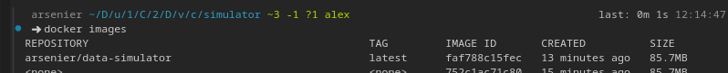
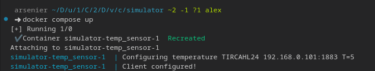
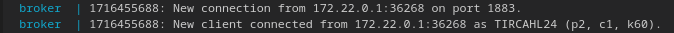
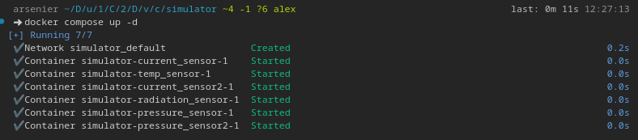
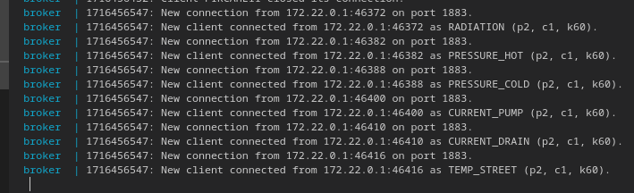
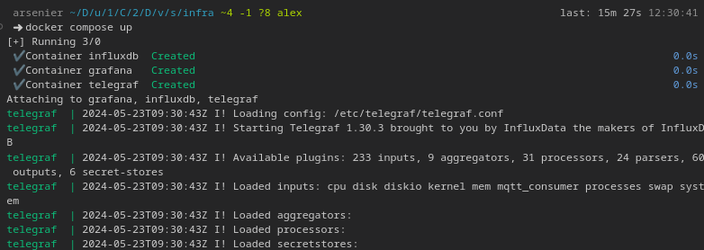
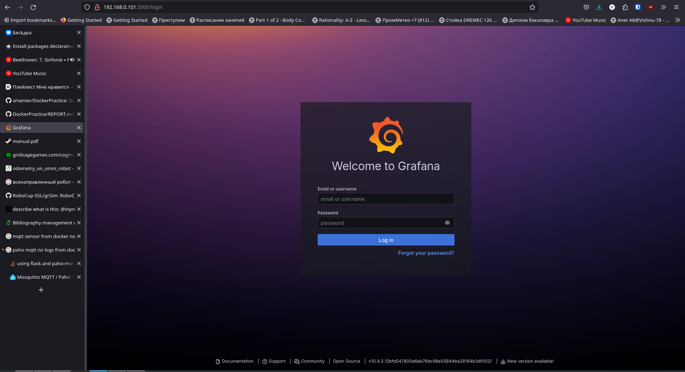
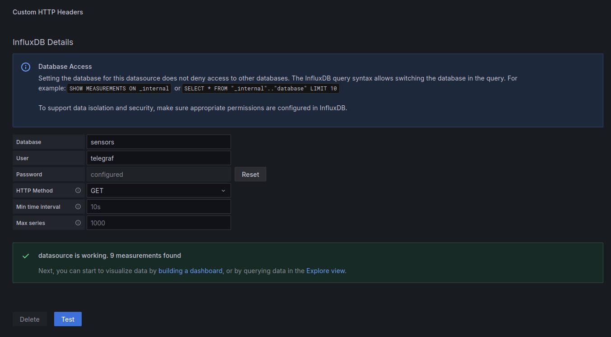
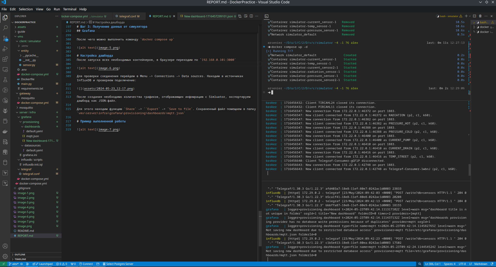
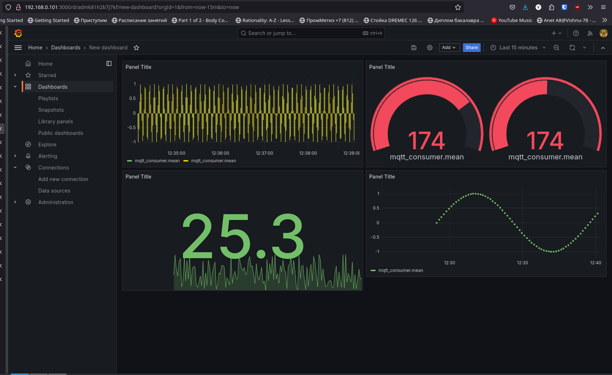

# Шаг 1: Разработка Simulator для генерации данных

В файле `sensor.py` создаем четвертый тип датчиков *Radiation*, прназначение которого измерять фоновый уровень радиации.

```python 
class Radiation(Sensor):
    step = 0

    def __init__(self, name):
        super().__init__(name)
        self.type = "radiation"

    def generate_new_value(self):
        import math

        self.value = math.sin(self.step)
        self.step = self.step + 0.1
```

Далее в файле `main.py` реализовуем клиента, который подключается к mqtt брокеру и публикует сообщения.


```python
import paho.mqtt.client as mqttclient
from os import environ
import time

from entity.sensor import *

broker = "localhost" if "SIM_HOST" not in environ.keys() else environ["SIM_HOST"]
port = 1883 if "SIM_PORT" not in environ.keys() else int(environ["SIM_PORT"])
name = "sensor" if "SIM_NAME" not in environ.keys() else environ["SIM_NAME"]
period = 1 if "SIM_PERIOD" not in environ.keys() else int(environ["SIM_PERIOD"])
type_sim = "temperature" if "SIM_TYPE" not in environ.keys() else environ["SIM_TYPE"]
sensors = {
    "temperature": Temperature,
    "pressure": Pressure,
    "current": Current,
    "radiation": Radiation,
}

isConnected = False


def on_connect(client, userdata, flags, rc):
    if rc == 0:
        print(f"Connected to {broker}")
        global isConnected
        isConnected = True
    else:
        print("Is not connected")


def on_publish(client, userdata, result):  # create function for callback
    print("data published")


print(f"Configuring {type_sim} {name} {broker}:{port} T={period}")

sensor = sensors[type_sim](name=name)
client1 = mqttclient.Client(sensor.name)  # create client object
client1.on_connect = on_connect
client1.on_publish = on_publish  # assign function to callback


print("Client configured!")

time.sleep(1)

client1.connect(broker, port=port)  # establish connection
client1.loop_start()
while True:
    sensor.generate_new_value()
    ret = client1.publish(
        "sensors/" + sensor.type + "/" + sensor.name, sensor.get_data()
    )
    time.sleep(period)

client1.loop_stop()
client1.disconnect()
```


В `Dockerfile`, необходимом для того, что создать образ, указываем следуюещие инструкции:

``` Dockerfile
FROM python:alpine3.19
WORKDIR /app
COPY requirements.txt .
RUN pip install -r requirements.txt
COPY . .
CMD ["python", "main.py"]
```

`requirements.txt`:
```
paho_mqtt==1.6.1
```

После проделанных выше опреаций можно создать образ командой:

`docker build -t arsenier/data-simulator . `

Таким образом мы создали образ, из которого можно развернуть контейнер.



# Шаг 2: Запуск Mosquitto брокера

Для настройки протокола MQTT необходимо создать конфигурационный файл *mosquitto.conf* со следующим содержимымы:

```c
listener 1883
allow_anonymous true
```
Для более удобного запуска брокера создадим файл *docker-compose.yml* со следующим содержимым:

```yml
version: "3"
services:
  broker:
    image: eclipse-mosquitto
    container_name: broker
    volumes:
      - ./mosquitto/mosquitto.conf:/mosquitto/config/mosquitto.conf
    ports:
      - "1883:1883"
```

Теперь создав контейнер (из Шага 1), получим следующее:



Брокер же отображает присоединившегося клиента.



Теперь можно запустить несколько датчиков. Но перед этим необходимо прописать *docker-compose.yml*:

```yml
version: "3"

services:
  temp_sensor:
    image: arsenier/data-simulator
    environment:
      - SIM_HOST=192.168.0.101
      - SIM_PORT=1883
      - SIM_NAME=TEMP_STREET
      - SIM_PERIOD=5
      - SIM_TYPE=temperature
  pressure_sensor:
    image: arsenier/data-simulator
    environment:
      - SIM_HOST=192.168.0.101
      - SIM_NAME=PRESSURE_COLD
      - SIM_PERIOD=6
      - SIM_TYPE=pressure
  current_sensor:
    image: arsenier/data-simulator
    environment:
      - SIM_HOST=192.168.0.101
      - SIM_NAME=CURRENT_PUMP
      - SIM_PERIOD=1
      - SIM_TYPE=current
  pressure_sensor2:
    image: arsenier/data-simulator
    environment:
      - SIM_HOST=192.168.0.101
      - SIM_NAME=PRESSURE_HOT
      - SIM_PERIOD=4
      - SIM_TYPE=pressure
  current_sensor2:
    image: arsenier/data-simulator
    environment:
      - SIM_HOST=192.168.0.101
      - SIM_NAME=CURRENT_DRAIN
      - SIM_PERIOD=1
      - SIM_TYPE=current
  radiation_sensor:
    image: arsenier/data-simulator
    environment:
      - SIM_HOST=192.168.0.101
      - SIM_NAME=RADIATION
      - SIM_PERIOD=10
      - SIM_TYPE=radiation

```
С помощью команды `docker compose up` запустим одноврменно 6 контейнеров:



При этом брокер отображает:



# Шаг 3: Получение данных от симулятора
Первоначально необходимо настроить Telegraf, который  подписывается на MQTT, где датчики публикуют данные. Данные будут сохраняться в InfluxDB. Отображение информации с датчиков будет происходить при помощи Grafana.

## Telegraf
Перед использованием Telegram необходимо настроить его.
Для этого откроем конфигурационный файл *telegraf.conf* и в разделе `[[inputs.mqtt_consumer]]`пропишем следующее:

```c
servers = ["tcp://192.168.0.101:1883"] # адрес vm с mqtt-брокером
topics = [
  "sensors/#"
]
data_format = "value"
data_type = "float"
```
Тем самым мы настраиваем Telegraf на чтение данных с машины IP адрес которой 192.168.0.101 через порт 1883.

Также настроим разедл вывода `[[outputs.influxdb]]`:
```c
urls = ["http://influxdb:8086"] 
database = "sensors"
skip_database_creation = true
username = "telegraf"
password = "telegraf"
```
Настройка Telegraf на этом завршена. 

## InfluDB

Для создания базы данных необходимо в конфигурационном файле *influxdb-init.iql* прописать следующее:
```sql
CREATE database sensors
CREATE USER telegraf WITH PASSWORD 'telegraf' WITH ALL PRIVILEGES
```

## Grafana

Данные для отображения датчиков берутся из InfluxDB.
Для настройки в конфигурационном файле необходимо прописать следующее:
```yaml
apiVersion: 1

datasources:
  - name: InfluxDB_v1
    type: influxdb
    access: proxy
    database: sensors
    user: telegraf
    url: http://influxdb:8086
    jsonData:
      httpMode: GET
    secureJsonData:
      password: telegraf
```

Для запуска всех трех контенйеров воспользуемся docker-compose. 

В *docker-compose.yml* пропишем следующее:

```yml
version: "3"
services:
  influxdb:
    image: influxdb:1.8
    container_name: influxdb
    volumes:
      - ./influxdb/scripts:/docker-entrypoint-initdb.d
      - influx_data:/var/lib/influxdb
    networks:
      - server-net
  telegraf:
    image: telegraf
    container_name: telegraf
    volumes:
      - ./telegraf:/etc/telegraf:ro
    restart: unless-stopped
    networks:
      - server-net
  grafana:
    image: grafana/grafana
    container_name: grafana
    volumes:
      - grafana_data:/var/lib/grafana
      - ./grafana/:/etc/grafana/

    environment:
      - GF_SECURITY_ADMIN_USER=admin
      - GF_SECURITY_ADMIN_PASSWORD=admin
      - GF_USERS_ALLOW_SIGN_UP=false
    restart: unless-stopped
    ports:
      - 3000:3000
    networks:
      - server-net

volumes:
  influx_data: {}
  grafana_data: {}

networks:
  server-net: {}
```

После чего можно выполнить команду `docker compose up`



# Настройка дашборда
После запуска всех необходимых контейнеров, в браузере переходим по `192.168.0.101:3000`



Для проверки соединения перейдем в Menu -> Connections -> Data sources. Находим в истончиках InfluxDB и проверяем подключение:



После создания необходимо количества графиков, отображающих инфомрацию с Simluator, экспортируем дашборд как JSON-файл.

Для этого находим функцию `Share` -> ``Export` -> `Save to file`. Сохраненный файл помещаем в папку `vms\server\infra\grafana\provisioning\dashboards\mqtt.json`

# Пример выполненной работы



