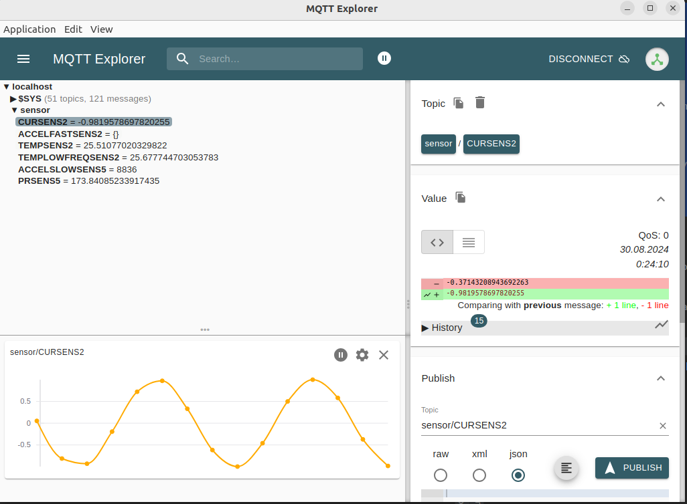

## Настройки Docker и создание скриптов
Для настройки файла контейнера докера воспользуемся следующим конфигом конфигом


Cоздадим образ на основе файла Dockerfile и контекста:


Конфиг docker-compose файла симулятора выглядит следующим образом:


Конфиг docker-compose файла сервера выглядит следующим образом:


Запустим симулятор через докер:


Загрузим на докер-хаб:


В результате на докер-хабе у нас появится json образ симулятора:


А в самом докере у нас появится новый контейнер temperature:


Запустим контейнер с mosquitto брокером (в результате запуска контейнера с симулятором датчика увидим подключение):



А так же в самом докере появится контейнер с mosquitto брокером:


После запуска симулятора можно будет отследить работу брокера:


## Работа с PlayWithDocker

С помощью команды загрузим все нужные файлы:

```shell
$ git clone -b develop https://github.com/Chilipinas/DockerPractice.git
```
### Клиент (Докер 1)
После запуска simulator.sh скрипта на виртуальной машине развернется три контейнера с разными симуляторами датчиков. Так же автоматически настроится ip route к серверу gateway.


### Шлюз (Докер 2)
После запуска gateway.sh будет настроен путь к двум другим серверам, так же будет запущен контейнер с брокером


### Сервер (Докер 3)
После запуска server.sh будет настроен ip route а так же запущены три контейнера


Настройка базы данных grafana:


Проверим результаты работы, для этого создадим и настроим Dashboard:wa