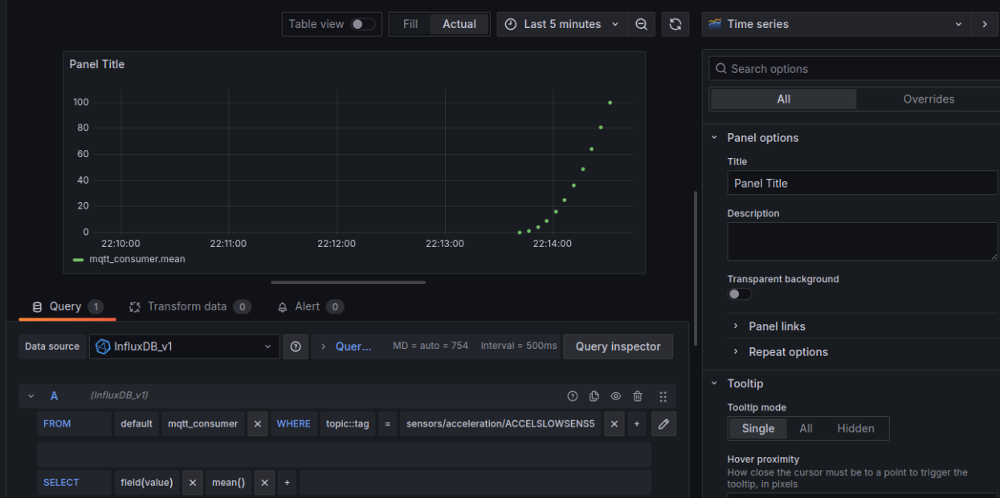
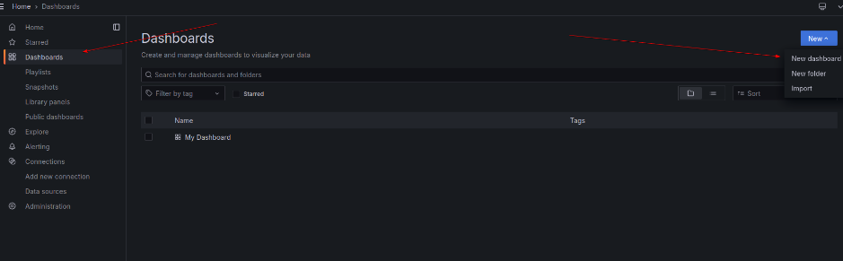
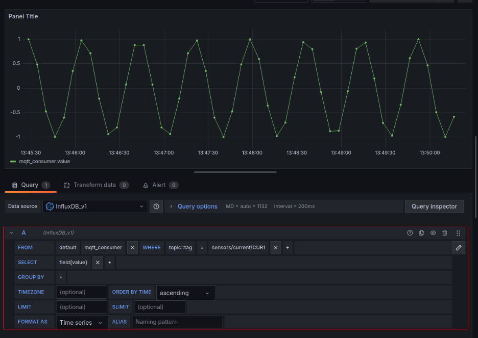

## Настройки Docker и создание скриптов
Для настройки файла контейнера докера воспользуемся следующим конфигом конфигом


Cоздадим образ на основе файла Dockerfile и контекста:


Конфиг docker-compose файла симулятора выглядит следующим образом:


Конфиг docker-compose файла сервера выглядит следующим образом:



Запустим симулятор через докер:


Загрузим на докер-хаб:



В результате на докер-хабе у нас появится json образ симулятора:



А в самом докере у нас появится новый контейнер temperature:


Запустим контейнер с mosquitto брокером (в результате запуска контейнера с симулятором датчика увидим подключение):


После запуска симулятора можно будет отследить работу брокера:


## Работа с PlayWithDocker

С помощью команды загрузим все нужные файлы:

```shell
$ git clone -b develop https://github.com/Chilipinas/DockerPractice.git
```


