# Отчёт
-----
## Разработка скрипта

Для генерации данных создаём класс Sensor.

Далее определяем 4 типа датчика, наследники ранее созданного класса: Temperature, Pressure, Current, Humidity. Код хранится в файле sensor.py
```
class Sensor:
    value: float
    name: str
    type: str

    def __init__(self, name):
        self.name = name

    def generate_new_value(self):
        pass

    def get_data(self):
        return self.value

    def __str__(self):
        return str({"type": self.type, "name": self.name, "value": self.value})

```
После этого настраиваем конфигурационный файл докер образа (DockerFile)

```
FROM python:3.7
WORKDIR /app
COPY requirements.txt .
RUN pip install -r requirements.txt
COPY . .
CMD ["python", "main.py"]
```
Выполним сборку докер - образа с помощью следующией команды:
```
sudo docker build -t primaklubov/sim_sensor .
```
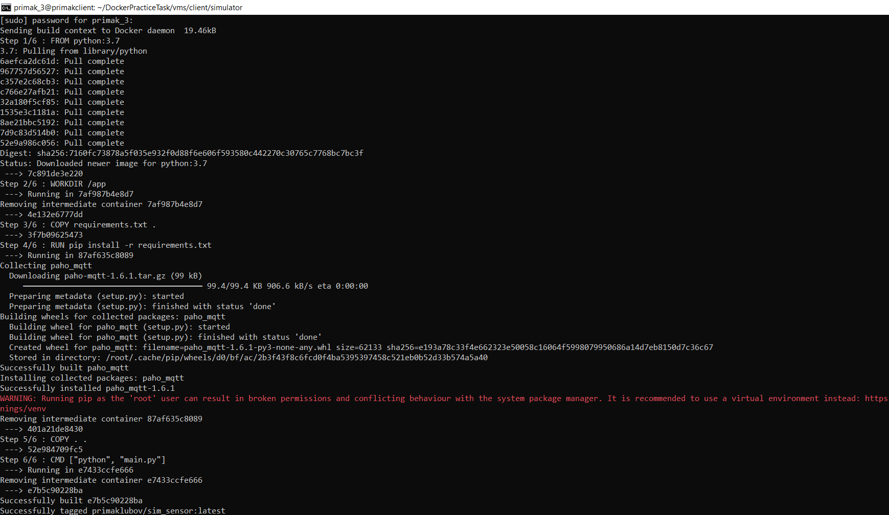 

Далее запускаем докер контейнер брокера mosquitto c помощью команды
```
sudo docker run --rm -p 1883:1883 -v $PWD/mosquitto/mosquitto.conf:/mosquitto/config/mosquitto.conf --name broker eclipse-mosquitto
```
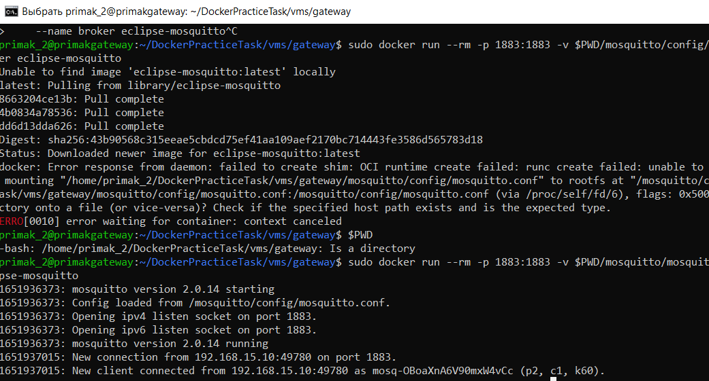 

Проверяем подключение

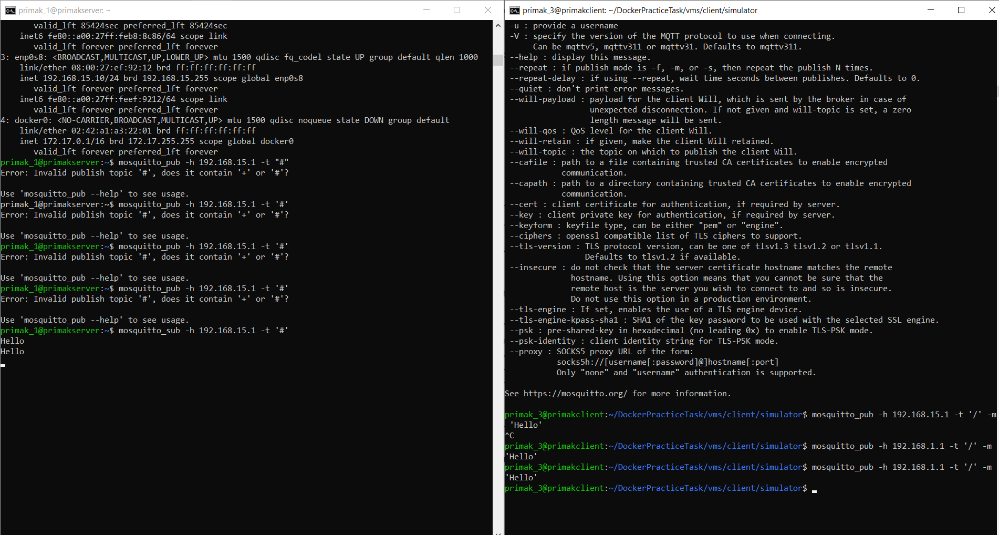 

Выполним запуск:
```
docker run --rm -e SIM_PORT=1883 -e SIM_HOST=192.168.1.1 -e SIM_NAME=temperature_sensor_001 -e SIM_PERIOD=3 -e SIM_TYPE=temperature primaklubov/sim_sensor sim_sensor
```
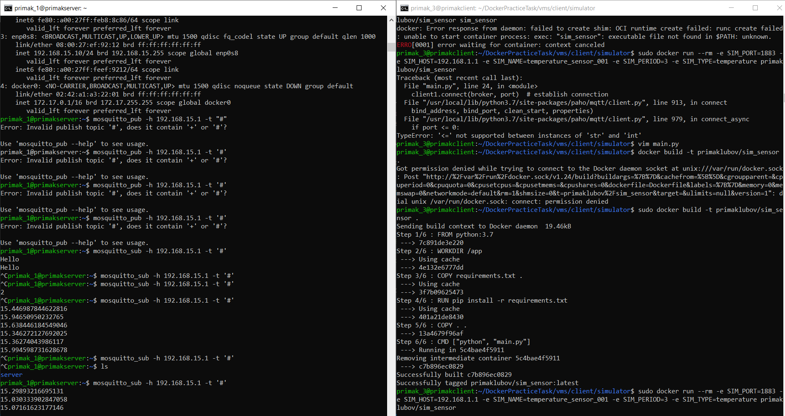 

Отправляем образ в DockerHub

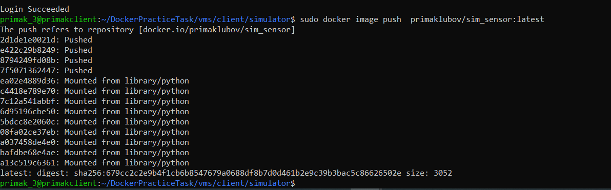

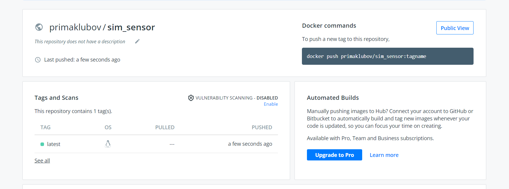  

После этого создаём файл docker-compose:
```
version: "3"

services:
  temp_sensor:
    image: primaklubov/sim_sensor
    environment:
      - SIM_HOST=192.168.1.1
      - SIM_NAME=sim_1
      - SIM_PERIOD=5
      - SIM_TYPE=temperature
  pressure_sensor:
    image: primaklubov/sim_sensor
    environment:
      - SIM_HOST=192.168.1.1
      - SIM_NAME=sim_2
      - SIM_PERIOD=5
      - SIM_TYPE=pressure
  current_sensor:
    image: primaklubov/sim_sensor
    environment:
      - SIM_HOST=192.168.1.1
      - SIM_NAME=sim_3
      - SIM_PERIOD=1
      - SIM_TYPE=current
  humidity_sensor:
    image: primaklubov/sim_sensor
    environment:
      - SIM_HOST=192.168.1.1
      - SIM_NAME=sim_4
      - SIM_PERIOD=10
      - SIM_TYPE=humidity      
```
Запускаем файл и проверяем работу

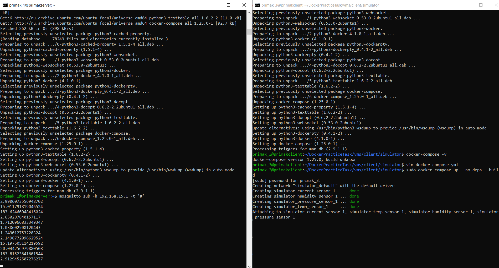  

Далее выполним подключение к Grafana

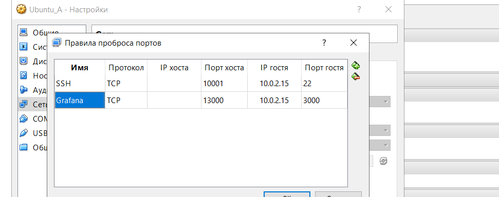 

Осуществляем подключение и настраиваем Dashboard

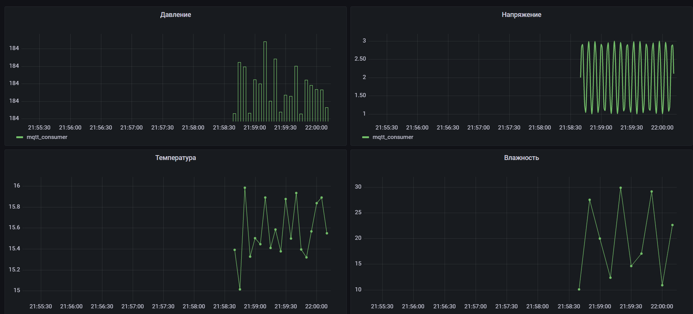 

Настроиваем правила на gateway

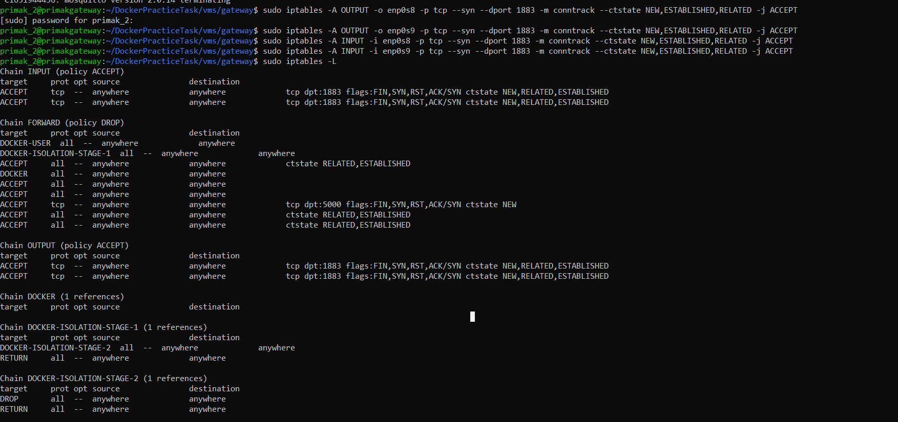 

Проверяем работу правил

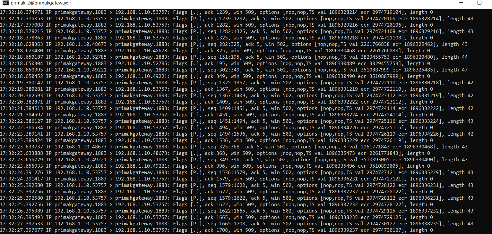 


## Команды для виртуальных машин

### Gateway
```
sudo docker run --rm -p 1883:1883 -v $PWD/mosquitto/mosquitto.conf:/mosquitto/config/mosquitto.conf --name broker eclipse-mosquitto
```

### Client
```
sudo docker-compose up --no-deps --build
```

### Server
```
sudo docker-compose up
```


