## Подготовка скрипта с данными

Создаем модуль "sensor.py", который будет генерировать наши данные подобно реальным датчикам на производстве. Тут есть наследуемый класс "Sensor" с абстрактными методами.
Есть 3 наследника у класса Sensor:
- датчик температуры Temperature
- датчик давления Pressure
- датчик тока Current

Создадим и настроим конфиг файл докер-образа

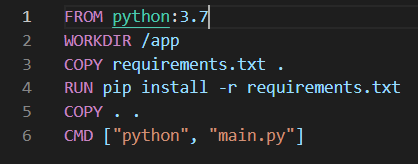 

Проверим, компилируется ли докер-образ.

```shell
$ docker build -t ilyakonstantinovich/sensor-sim .
```
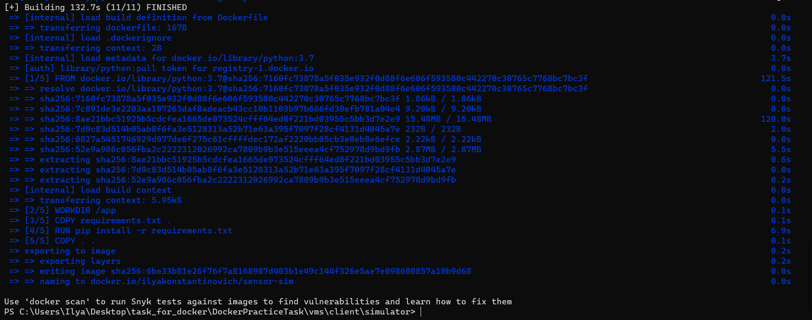 
Также в  терминале проверим работу брокера москитто. С помощью Docker Desktop и MQQT Explorer посмотрим, запустился ли брокер и получает ли он что-то.
```shell
$ docker run -it --rm -p 10000:1883 \
    -v $PWD\mosquitto\config\mosquitto.conf:/mosquitto/config/mosquitto.conf  eclipse-mosquitto
```
```shell
$ docker run -e SIM_HOST=192.168.219.193 \
-e SIM_TYPE=temperature --name temperature \
ilyakonstantinovich/sensor-sim
```
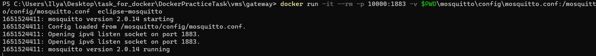 

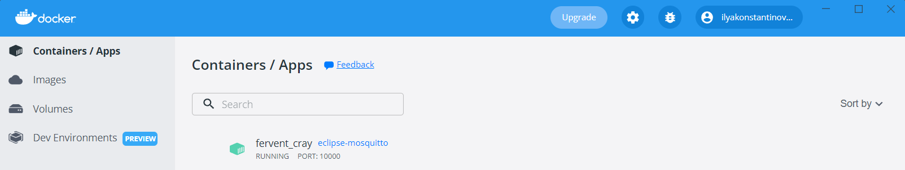 

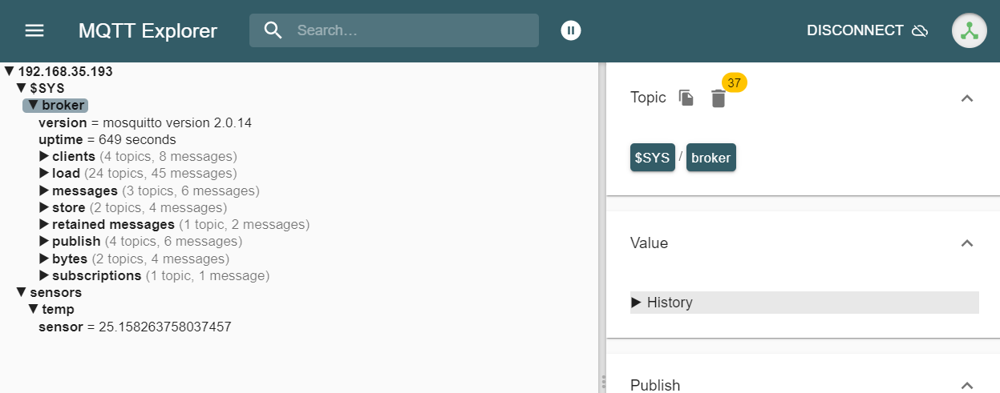


Теперь нужно залить наш докер контейнер в Docker Hub

```shell
$ docker image push ilyakonstantinovich/sensor-sim:latest
```
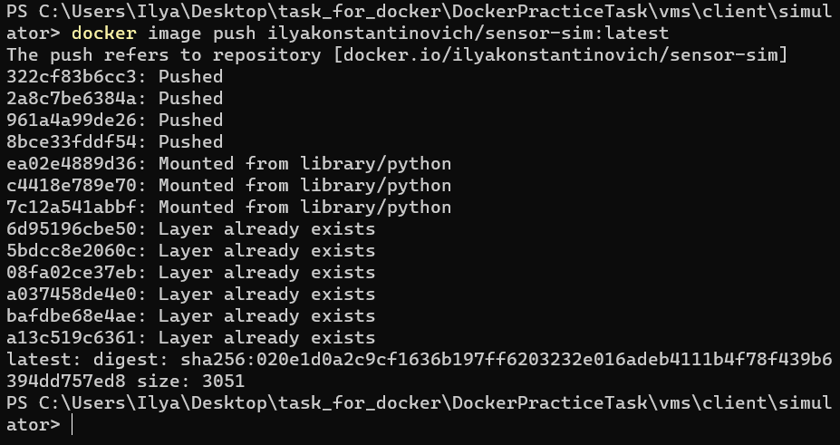


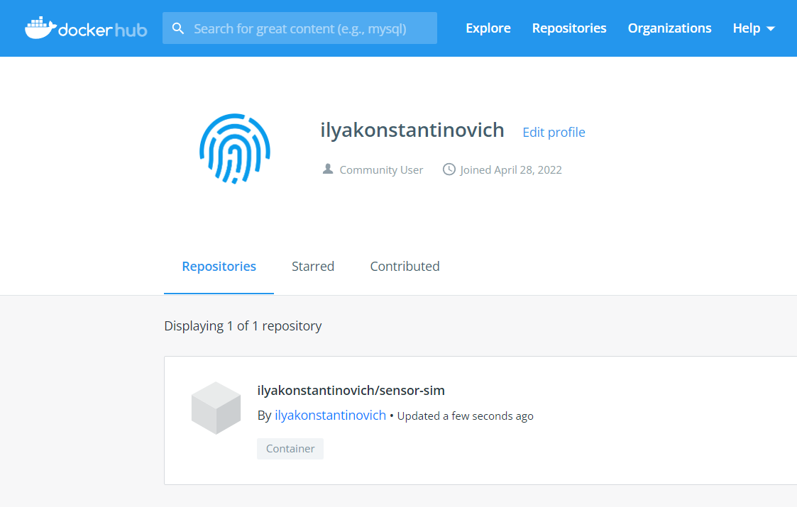

Теперь сконфигурируем и используем docker-compose, чтобы работать сразу с несколькими контейнерами и получать данные с разных "датчиков". Конфигурируем файл "docker-compose.yml" 
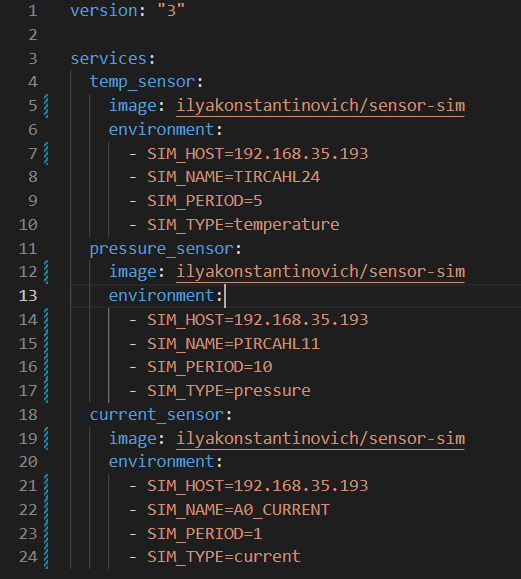
Запуск контейнеров:
```shell
$ docker-compose up -d --no-deps --build
```
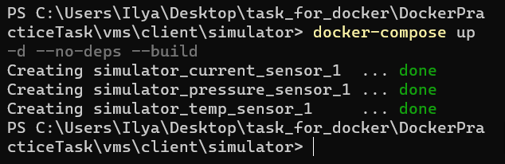
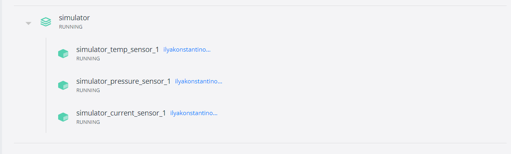
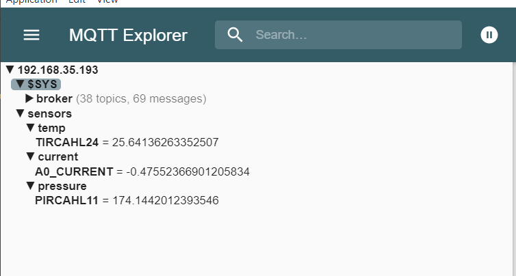

Теперь для работы с виртуальными машинами, нужно скопировать туда наши файлы.

```shell
scp -P 40000 -r .\vms\server\infra golovakov_1@localhost:/home/golovakov_1/infra
scp -P 40001 -r .\vms\gateway\mosquitto golovakov_2@localhost:/home/golovakov_2/mosquitto
scp -P 40002 -r .\vms\client\simulator golovakov_3@localhost:/home/golovakov_3/sensor_sim

```
Зайдем на виртуальные машины и увидим, что файлы перекинулись.


## Работа на виртуальной машине - Gateway
Необходимо запустить докер файлы на каждой виртуальной машине.

```shell
$ sudo docker run -p 1883:1883 \
    -v $PWD/mosquitto/config/mosquitto.conf:/mosquitto/config/mosquitto.conf  \
    --name broker eclipse-mosquitto
```

## Работа на виртуальной машине - Client

```shell
$ docker-compose up -d --no-deps --build
```

## Работа на виртуальной машине - Server

```shell
$ sudo docker-compose up
```
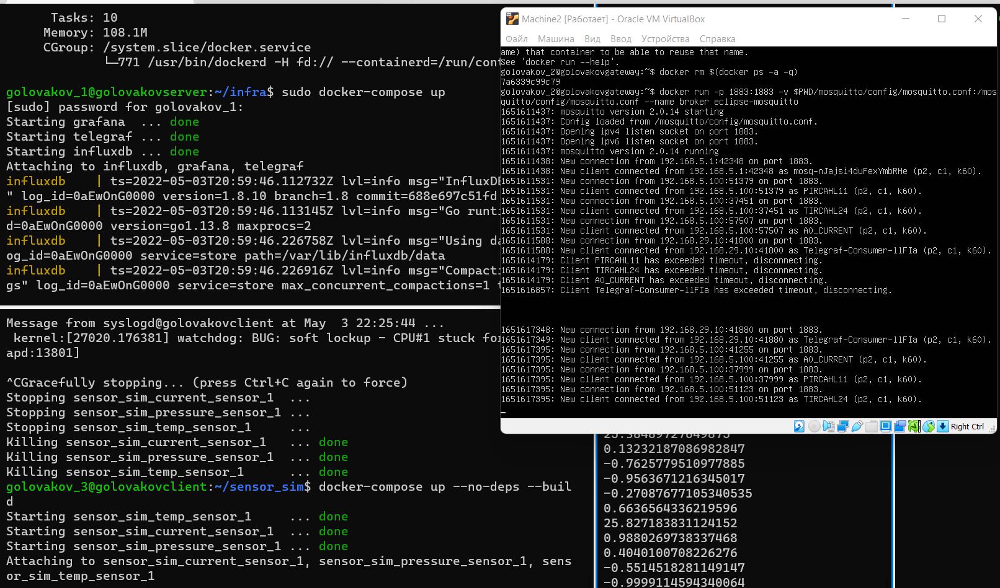

Подключаемся к Grafana  и делаем проброску портов у первой виртуальной машины 

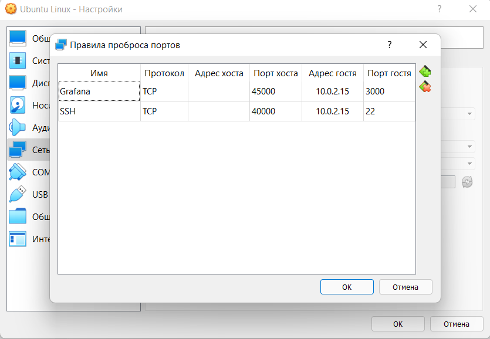

Проверим подключение к grafana через браузер ```localhost:45000```


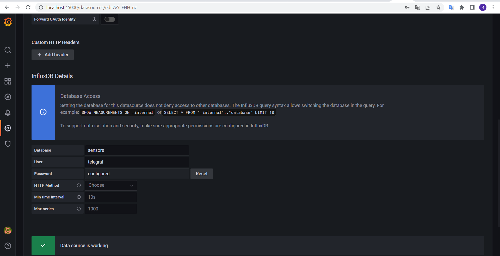

Здесь построим графики из полученных через брокера данных от датчиков

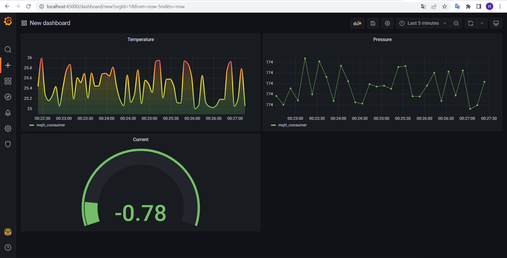

Также сделаем правила для порта 1883 в iptables

```shell
$ sudo iptables -L
$ sudo iptables -A OUTPUT -o enp0s8 -p tcp --syn --dport 1883 -m conntrack --ctstate NEW,ESTABLISHED,RELATED -j ACCEPT
$ sudo iptables -A OUTPUT -o enp0s9 -p tcp --syn --dport 1883 -m conntrack --ctstate NEW,ESTABLISHED,RELATED -j ACCEPT
$ sudo iptables -A INPUT -i enp0s8 -p tcp --syn --dport 1883 -m conntrack --ctstate NEW,ESTABLISHED,RELATED -j ACCEPT
$ sudo iptables -A INPUT -i enp0s9 -p tcp --syn --dport 1883 -m conntrack --ctstate NEW,ESTABLISHED,RELATED -j ACCEPT
```

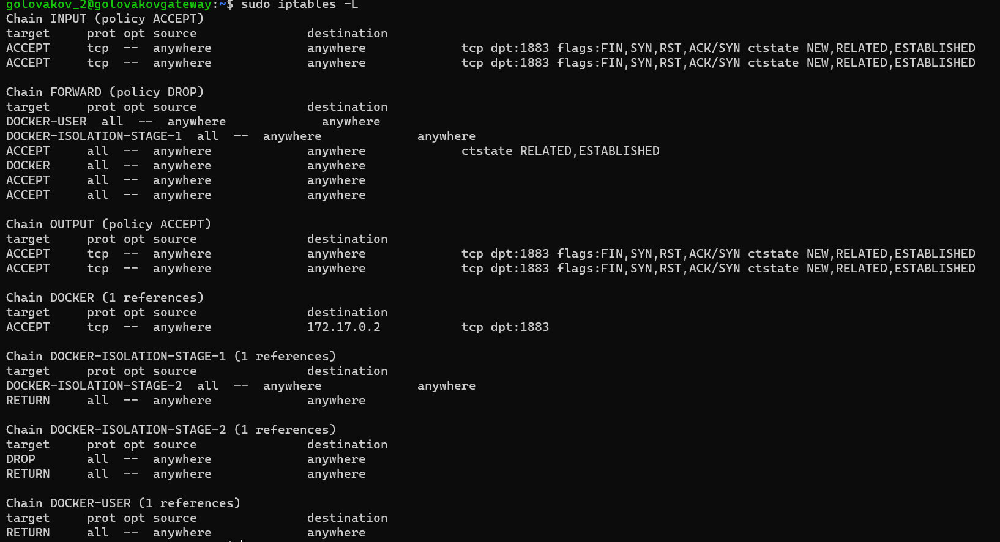

После внесения изменений необходимо их сохранить

```shell
$ sudo su
root# sudo iptables-save > /etc/iptables/rules.v4
root# sudo ip6tables-save > /etc/iptables/rules.v6
root# exit
```

```shell
$ sudo tcpdump -i enp0s9 not icmp
```

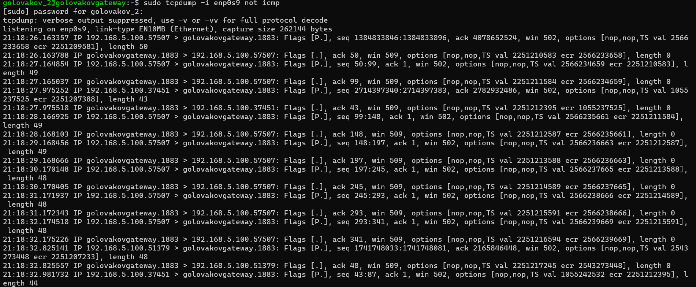