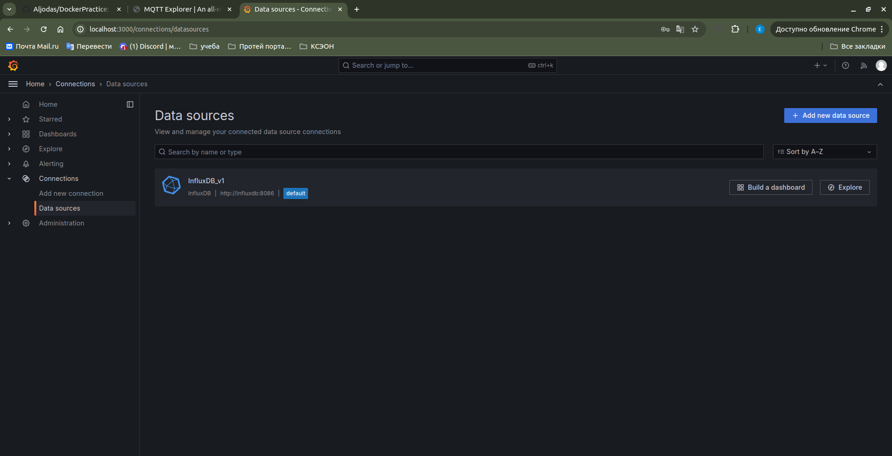

# *Отчет*: Взаимодействие docker-контейнеров

**Выполнила** Кузьменко Елена
**Группа** 5142704/30801

## Симуляция датчиков - генерация данных

Добавим четвертый тип датчиков: в файле `sensor.py` создадим новый класс *Acceleration*, который будет предназначен для работы с датчиками ускорения.

```python
class Acceleration(Sensor):
    step = 0
    
    def __init__(self, name):
        super().__init__(name)
        self.type = "acceleration"

    def generate_new_value(self):
        self.value = self.step ** 2
        if (self.value > 5e5):
            self.value = 5e5
        self.step += 1
```

В методе main объявим два метода для логирования состояния клиента
```python
import paho.mqtt.client as mqttclient
from os import environ
import time

from entity.sensor import *

broker = "localhost" if "SIM_HOST" not in environ.keys() else environ["SIM_HOST"]
port = 1883 if "SIM_PORT" not in environ.keys() else int(environ["SIM_PORT"])
name = "sensor" if "SIM_NAME" not in environ.keys() else environ["SIM_NAME"]
period = 1 if "SIM_PERIOD" not in environ.keys() else int(environ["SIM_PERIOD"])
type_sim = "temperature" if "SIM_TYPE" not in environ.keys() else environ["SIM_TYPE"]
sensors = {"temperature": Temperature, "pressure": Pressure, "current": Current, "acceleration": Acceleration}

isConnected = False

def on_connect(client,userdata,flags,rc):
    if rc == 0:
        print(f"Connected to {broker}")
        global isConnected
        isConnected = True
    else:
        print("Is not connected")


def on_publish(client,userdata,result):             #create function for callback
    print("data published")

print(f"Configuring {type_sim} {name} {broker}:{port} T={period}")

sensor = sensors[type_sim](name=name)
client1 = mqttclient.Client(sensor.name)  # create client object
client1.on_connect = on_connect
client1.on_publish = on_publish  # assign function to callback


print("Client configured!")


client1.connect(broker, port=port)  # establish connection
client1.loop_start()
while True:
    sensor.generate_new_value()
    ret= client1.publish(f"sensor/{sensor.name}", sensor.get_data())
    time.sleep(period)

client1.loop_stop()
client1.disconnect()
```

Приложение было запущено в Docker-контейнере с использованием Python Alpine версии 3.19. В проекте подключена библиотека paho_mqtt версии 1.6.1, которая реализует протокол MQTT.

*Dockerfile*:
```dockerfile
FROM python:alpine3.19
WORKDIR /app
COPY requirements.txt .
RUN pip install -r requirements.txt
COPY . .
CMD ["python", "main.py"]
```
Создадим docker image используя команду
```ssh
docker build -t alena/sensor .
```
Для запуска нескольких контейнеров был создан файл docker-compose, который настраивает 6 контейнеров для 4 типов датчиков.
### Параметры контейнера
- Тип датчика
- Имя датчика
- Период отправки
- Адрес отправки
```docker 
version: "3"

services:
  temp_sensor:
    image: alena/sensor
    environment:
      - SIM_HOST=192.168.0.104
      - SIM_NAME=TEMPSENS2
      - SIM_PERIOD=2
      - SIM_TYPE=temperature

  temp_low_freq_sensor:
    image: alena/sensor
    environment:
      - SIM_HOST=192.168.0.104
      - SIM_NAME=TEMPLOWFREQSENS2
      - SIM_PERIOD=10
      - SIM_TYPE=temperature

  pressure_sensor:
    image: alena/sensor
    environment:
      - SIM_HOST=192.168.0.104
      - SIM_NAME=PRSENS5
      - SIM_PERIOD=5
      - SIM_TYPE=pressure

  current_sensor:
    image: alena/sensor
    environment:
      - SIM_HOST=192.168.0.104
      - SIM_NAME=CURSENS2
      - SIM_PERIOD=2
      - SIM_TYPE=current

  accel_slow_sensor:
    image: alena/sensor
    environment:
      - SIM_HOST=192.168.0.104
      - SIM_NAME=ACCELSLOWSENS5
      - SIM_PERIOD=5
      - SIM_TYPE=acceleration

  accel_fast_sensor:
    image: alena/sensor
    environment:
      - SIM_HOST=192.168.0.104
      - SIM_NAME=ACCELFASTSENS2
      - SIM_PERIOD=2
      - SIM_TYPE=acceleration
```

Прежде чем поднимать все 6 контейнеров, для начала поднимем брокер сообщений

Для получения данных по MQTT используется MQTT-брокер, который реализован в образе `eclipse-mosquitto`.

Чтобы получить образ, выполните команду `docker pull eclipse-mosquitto`. Для настройки брокера создайте конфигурационный файл `mosquitto.conf`. При запуске контейнера используйте `docker volumes` с флагом `-v` для подключения этого файла к образу.

*mosquitto.conf*
```yml
listener 1883
allow_anonymous true
```

Для удобного запуска контейнера сформирован docker-compose файл.

*docker-compose*
```yml
version: "3"
services:
  broker:
    image: eclipse-mosquitto
    container_name: broker
    volumes:
      - ./mosquitto/mosquitto.conf:/mosquitto/config/mosquitto.conf
    ports:
      - "1883:1883"
```

Теперь поднимем брокер и 6 контейнеров 


Проверим активность через mqtt explorer

Как мы видим, имеется 6 подключений и график соответсвует дейтсвительной формуле

## Отображение данных
Отображение данных осуществлялось посредствам 3-х контейнеров: `telegraf`, `influxdb`, `grafana`.

### InfluxDB
InfluxDB предоставляет возможность хранения данных в реальном времени, что делает его идеальным для данной задачи.

Используемый образ: `influxdb:1.8`.

Для работы с InfluxDB необходимо создать конфигурационный файл, в котором будет указано, какую таблицу создать. В данном случае это таблица `sensors`. Также создается пользователь *telegraf*, который будет использоваться для подключения контейнера `telegraf` к базе данных.

Файл *influxdb-init.iql* будет содержать следующие команды:
```SQL
CREATE database sensors
CREATE USER telegraf WITH PASSWORD 'telegraf' WITH ALL PRIVILEGES
```

Все команды передаются через скрипт, который подключается к контейнеру с помощью volume. Все настройки указываются в файле docker-compose.

### Telegraf
Telegraf предназначен для считывания данных из брокера и записи их в базу данных, в данном случае — в `influxdb`.

Для контейнера создается конфигурационный файл `telegraf.conf`, в котором указывается источник данных (адрес брокера) и место назначения (адрес базы данных).

Файл *telegraf.conf* будет выглядеть следующим образом после удаления всех закоментированных участков конфигурации:
```yml
[global_tags]
[agent]
  interval = "10s"
  round_interval = true
  metric_batch_size = 1000
  metric_buffer_limit = 10000
  collection_jitter = "0s"
  flush_interval = "10s"
  flush_jitter = "0s"
  precision = "0s"
    hostname = ""
    omit_hostname = false
[[outputs.influxdb]]
urls = ["http://influxdb:8086"]
database = "sensors"
skip_database_creation = true
username = "telegraf"
password = "telegraf"
[[inputs.cpu]]
    percpu = true
    totalcpu = true
    collect_cpu_time = false
    report_active = false
[[inputs.disk]]
    ignore_fs = ["tmpfs", "devtmpfs", "devfs", "iso9660", "overlay", "aufs", "squashfs"]
[[inputs.diskio]]
[[inputs.kernel]]
[[inputs.mem]]
[[inputs.processes]]
[[inputs.swap]]
[[inputs.system]]
[[inputs.mqtt_consumer]]
servers = ["tcp://192.168.0.104:1883"]
topics = ["sensors/#"]
data_format = "value"
data_type = "float"
```

### Grafana
Grafana предназначена для визуализации данных в реальном времени с помощью графиков. Она позволяет создавать панели, которые могут содержать множество графиков и обновляться в режиме реального времени. Кроме того, Grafana предлагает удобный веб-интерфейс и функции аутентификации.

Поднимем все компоненты мониторинга в docker-compose

В графане видим наличие источника данных influx

Для визуализации создадим новый дашборд

