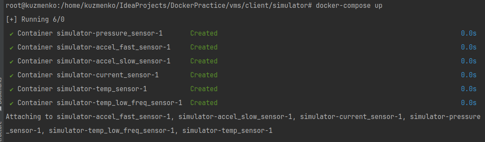
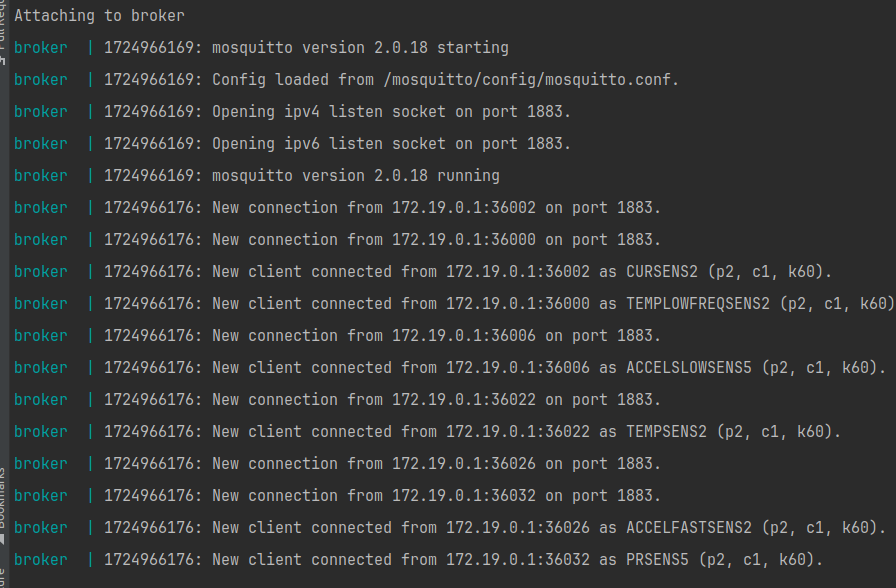

Добавим 4 типа датчиков: в файле `sensor.go`.

```go
package entity

import (
	"encoding/json"
	"log"
	"math"
	"math/rand"
)

type Sensor interface {
	GenerateNewValue()
	GetData() float64
	String() string
	GetName() string
	GetType() string
}

type BaseSensor struct {
	Name  string
	Value float64
	Type  string
}

func (s *BaseSensor) GenerateNewValue() {}

func (s *BaseSensor) GetData() float64 {
	return s.Value
}
func (s *BaseSensor) GetType() string {
	return s.Type
}
func (s *BaseSensor) GetName() string {
	return s.Name
}

func (s *BaseSensor) String() string {
	data, _ := json.Marshal(s)
	return string(data)
}

type Temperature struct {
	BaseSensor 
	Step       float64
}

func NewTemperature(name string) *Temperature {
	return &Temperature{
		BaseSensor: BaseSensor{Name: name, Type: "temperature"},
		Step:       25,
	}
}

func (t *Temperature) GenerateNewValue() {
	t.Value = rand.Float64() + t.Step
}

type Pressure struct {
	BaseSensor 
	Step       float64
}

func NewPressure(name string) *Pressure {
	return &Pressure{
		BaseSensor: BaseSensor{Name: name, Type: "pressure"},
		Step:       55,
	}
}

func (p *Pressure) GenerateNewValue() {
	p.Value = rand.Float64() + p.Step - 56.48 + 25*7
}

type Current struct {
	BaseSensor // Встраивание BaseSensor
	Step       float64
}

func NewCurrent(name string) *Current {
	return &Current{
		BaseSensor: BaseSensor{Name: name, Type: "current"},
		Step:       0,
	}
}

func (c *Current) GenerateNewValue() {
	c.Value = math.Sin(c.Step)
	c.Step++
}

type Humidity struct {
	BaseSensor
}

func NewHumidity(name string) *Humidity {
	return &Humidity{
		BaseSensor: BaseSensor{Name: name, Type: "humidity"},
	}
}

func (h *Humidity) GenerateNewValue() {
	h.Value = rand.Float64() * 100 
}

type Light struct {
	BaseSensor
}

func NewLight(name string) *Humidity {
	return &Humidity{
		BaseSensor: BaseSensor{Name: name, Type: "light"},
	}
}

func (h *Light) GenerateNewValue() {
	h.Value = rand.Float64() * 1000
}

func SensorFactory(typeS string, name string) Sensor {
	switch typeS {
	case "temperature":
		return NewTemperature(name)
	case "pressure":
		return NewPressure(name)
	case "current":
		return NewCurrent(name)
	case "humidity":
		return NewHumidity(name)
	case "light":
		return NewLight(name)
	default:
		log.Fatal("No such type of sensor")
		return nil
	}
}

```
Теперь создадим клиента, который будет подключаться к MQTT-брокеру и отправлять сообщения. Для этого мы создадим файл `main.go` с следующим кодом:
```go
package main

import (
	"encoding/json"
	"fmt"
	mqtt "github.com/eclipse/paho.mqtt.golang"
	"math/rand"
	"os"
	"sensor/entity"
	"strconv"
	"time"
)

func main() {
	rand.Seed(time.Now().UnixNano())
	broker := "localhost"
	if simHost := os.Getenv("SIM_HOST"); simHost != "" {
		broker = simHost
	}
	port := 1883
	if simPort := os.Getenv("SIM_PORT"); simPort != "" {
		if p, err := strconv.Atoi(simPort); err == nil {
			port = p
		}
	}
	name := "sensor"
	if simName := os.Getenv("SIM_NAME"); simName != "" {
		name = simName
	}
	period := 1
	if simPeriod := os.Getenv("SIM_PERIOD"); simPeriod != "" {
		if p, err := strconv.Atoi(simPeriod); err == nil {
			period = p
		}
	}
	typeSim := "temperature"
	if simType := os.Getenv("SIM_TYPE"); simType != "" {
		typeSim = simType
	}

	sensor := entity.SensorFactory(typeSim, name)

	opts := mqtt.NewClientOptions().AddBroker(fmt.Sprintf("tcp://%s:%d", broker, port)).SetClientID(sensor.GetName())
	opts.OnConnect = func(c mqtt.Client) {
		fmt.Println("Connected to MQTT broker")
	}
	client := mqtt.NewClient(opts)

	if token := client.Connect(); token.Wait() && token.Error() != nil {
		fmt.Println(token.Error())
		return
	}
	defer client.Disconnect(250)

	for {
		sensor.GenerateNewValue()
		data, _ := json.Marshal(sensor)
		client.Publish("sensors/"+sensor.GetType()+"/"+sensor.GetName(), 0, false, data)
		time.Sleep(time.Duration(period) * time.Second)
	}
}
```
Приложение будет развернуто в Docker-контейнере с использованием Go 1.23. Настроим файл `Dockerfile` следующим образом:
```dockerfile
FROM golang:1.23.0-alpine AS builder
WORKDIR /app
COPY go.mod go.sum ./
RUN go mod tidy
COPY . .
RUN go build -o myapp main.go
FROM alpine:latest
WORKDIR /app
COPY --from=builder /app/myapp .
CMD ["./myapp"]
```
Файл go.mod в Go  используется для управления зависимостями проекта и определения его модульной структуры.
Теперь создадим образ при помощи команды:
`docker build -t johnkeksex/sensor . `



Получили docker образ, из которого можно развернуть контейнер

Сконфигурируем файл *docker-compose.yml*, в котором укажем:

- Тип датчика
- Имя датчика
- Период отправки
- Адрес отправки

```dockerfile
version: "3"

services:
  temp_sensor:
    image: johnkeksex/sensors:latest
    environment:
      - SIM_HOST=192.168.0.104
      - SIM_NAME=TEMP1
      - SIM_PERIOD=2
      - SIM_TYPE=temperature

  pressure_sensor:
    image: johnkeksex/sensors:latest
    environment:
      - SIM_HOST=192.168.0.104
      - SIM_NAME=PRESS1
      - SIM_PERIOD=2
      - SIM_TYPE=pressure

  current_sensor:
    image: johnkeksex/sensors:latest
    environment:
      - SIM_HOST=192.168.0.104
      - SIM_NAME=CUR1
      - SIM_PERIOD=6
      - SIM_TYPE=current

  light_sensor:
    image: johnkeksex/sensors:latest
    environment:
      - SIM_HOST=192.168.0.104
      - SIM_NAME=LIGHT1
      - SIM_PERIOD=4
      - SIM_TYPE=light

  temp_second_sensor:
    image: johnkeksex/sensors:latest
    environment:
      - SIM_HOST=192.168.0.104
      - SIM_NAME=TEMP2
      - SIM_PERIOD=15
      - SIM_TYPE=temperature

  light_second_sensor:
    image: johnkeksex/sensors:latest
    environment:
      - SIM_HOST=192.168.0.104
      - SIM_NAME=LIGHT2
      - SIM_PERIOD=15
      - SIM_TYPE=light
```

Для настройки брокера необходимо создать конфигурационный файл `mosquitto.conf` со следующим содержимым:
```c
listener 1883
allow_anonymous true
```

Также создадим файл `docker-compose.yml` со следующим содержанием:
```yaml
version: "3"
services:
  broker:
    image: eclipse-mosquitto
    container_name: broker
    volumes:
      - ./mosquitto/mosquitto.conf:/mosquitto/config/mosquitto.conf
    ports:
      - "1883:1883"
```

Поднимем контейнер и проверим работу через mqtt-explorer


Как видим в логах появился новый клиент 



Запустим 1 экземпляр датчика 


Запустим теперь все 6 


## Отображение данных

Отображение данных будет организовано следующим образом:
* Мы настроим `Telegraf`, который будет подписываться на MQTT для получения данных от датчиков.
* Эти данные будут сохраняться в `InfluxDB`.
* Непосредственное визуализирование данных с датчиков будет осуществляться с помощью `Grafana`.

### Telegraf

Настроим `Telegraf`, изменив параметр `servers` в конфигурационном файле *telegraf.conf*:

*telegraf.conf*
```c
servers = ["tcp://192.168.0.104:1883"] # адрес виртуальной машины с MQTT-брокером
```

### InfluxDB

Для *InfluxDB* будем использовать образ `influxdb:1.8`.

Теперь настроим конфигурационный файл `influxdb-init.iql` для правильной работы InfluxDB. В этом файле укажем, какую таблицу необходимо создать — *sensors*:

*influxdb-init.iql*
```SQL
CREATE database sensors
CREATE USER telegraf WITH PASSWORD 'telegraf' WITH ALL PRIVILEGES
```

### Grafana

Данные для визуализации с датчиков будут извлекаться из InfluxDB. Для настройки в конфигурационном файле `default.yaml`, который находится в папке `datasource`, необходимо указать следующее:

*default.yaml*
```yaml
apiVersion: 1

datasources:
  - name: InfluxDB_v1
    type: influxdb
    access: proxy
    database: sensors
    user: telegraf
    url: http://influxdb:8086
    jsonData:
      httpMode: GET
    secureJsonData:
      password: telegraf
```

Теперь запустим все три контейнера с помощью docker-compose, но сначала настроим файл `docker-compose.yml`:
```dockerfile
version: "3"
services:
  influxdb:
    image: influxdb:1.8
    container_name: influxdb
    volumes:
      - ./influxdb/scripts:/docker-entrypoint-initdb.d
      - influx_data:/var/lib/influxdb
    networks:
      - server-net
  telegraf:
    image: telegraf
    container_name: telegraf
    volumes:
      - ./telegraf:/etc/telegraf:ro
    restart: unless-stopped
    networks:
      - server-net
  grafana:
    image: grafana/grafana
    container_name: grafana
    volumes:
      - grafana_data:/var/lib/grafana
      - ./grafana/:/etc/grafana/

    environment:
      - GF_SECURITY_ADMIN_USER=admin
      - GF_SECURITY_ADMIN_PASSWORD=admin
      - GF_USERS_ALLOW_SIGN_UP=false
    restart: unless-stopped
    ports:
      - 3000:3000
    networks:
      - server-net


volumes:
  influx_data: {}
  grafana_data: {}

networks:
  server-net: {}
```

Запуск полной инфраструктуры

### Настройка дашборда в Grafana

После запуска всех необходимых контейнеров откройте браузер и перейдите по адресу `192.168.0.102:3000`.


Для проверки соединения перейдите в меню -> Connections -> Data sources. Найдите источник InfluxDB и проверьте подключение:


Затем через меню перейдите в раздел Dashboards, где создайте новый дашборд.


Для отображения данных необходимо настроить запросы (query).


После создания необходимого количества графиков, отображающих данные с симулятора, экспортируйте дашборд в формате JSON.

Для этого используйте функцию `Share` -> `Export` -> `Save to file`. Сохраненный файл поместите в папку `vms/server/infra/grafana/provisioning/dashboards/mqtt.json`.

Настроенный дашборд будет выглядеть следующим образом:

